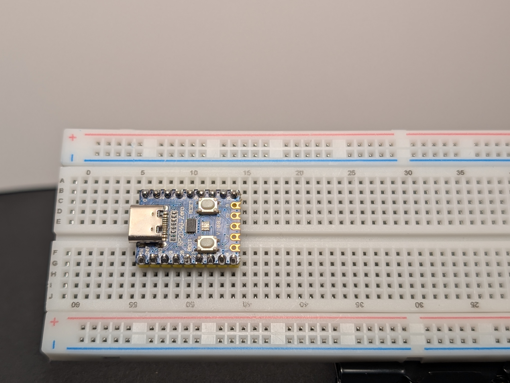
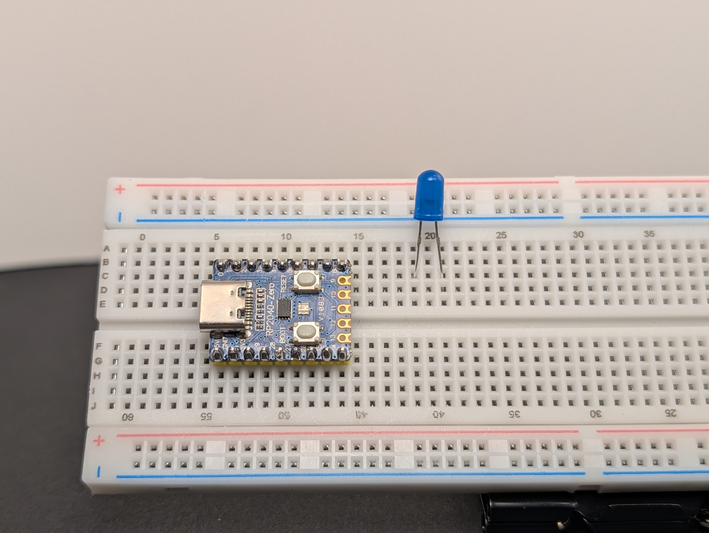
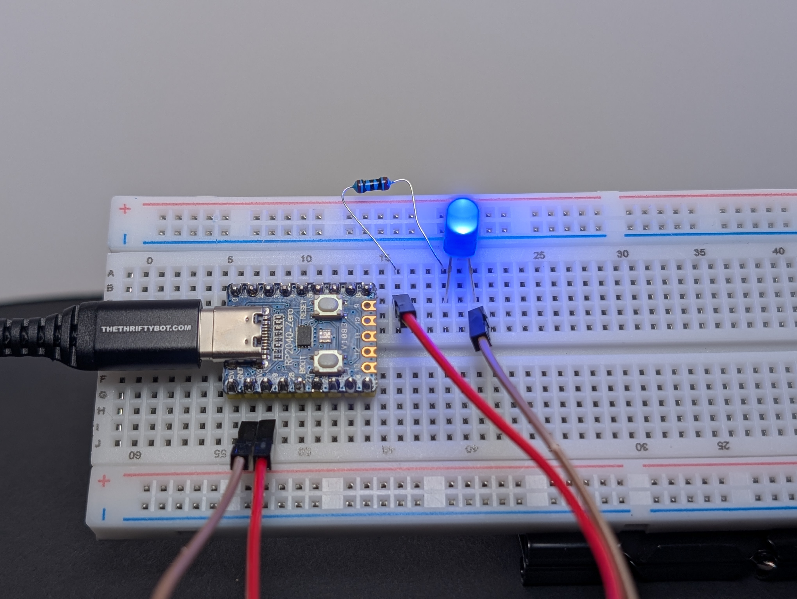
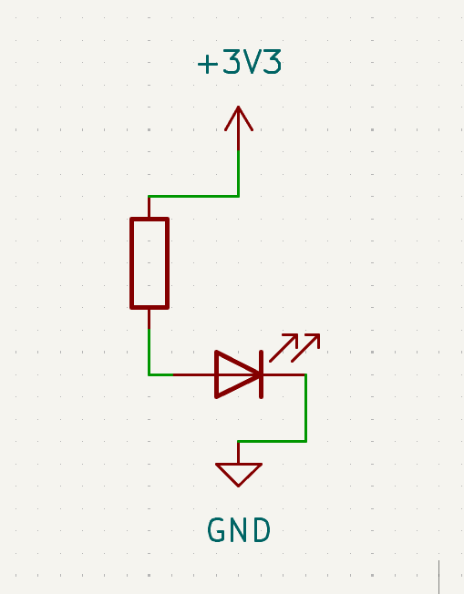

# 1: Simple LED

This is the first build because it teaches the main idea of a circuit: electricity needs a complete path.

In this project, you will build the simplest possible circuit: power goes out from `3V3`, through a resistor and LED, and returns to `GND`.

Along the way you will practice:

- what it means for a circuit to have a **complete path**
- why an LED must face the right direction (long leg `+`, short leg `-`)
- why a **resistor** protects the LED

Learn more (optional):

- [A circuit needs a complete path](../../index.md#a-circuit-needs-a-complete-path)
- [Resistance](../../index.md#resistance)

## Goal

Make one LED turn on.

## Parts you need

- 1 LED
- 1 resistor
- jumper wires
- breadboard
- RP2040-Zero

## Build idea

You are making a path like this:

`3V3 -> resistor -> LED -> GND`

That means power leaves the `3V3` pin, goes through the resistor, passes through the LED, and returns to `GND`.

## Build steps

Try each step, then check your work with the blurred photos below. Did you connect it the way you meant to?

!!! warning "Important: choose the right resistor"
    Your kit has **150Ω** and **100Ω** resistors.
    
    - For a **red or yellow** LED, use **150Ω**
    - For a **green, blue, or white** LED, use **100Ω**
    
    Using the wrong resistor can damage an LED.

1. Place the RP2040-Zero into the breadboard.
   { .spoiler-img width="50%" }
2. Place the LED on the breadboard so the two legs are in different rows.
   { .spoiler-img width="50%" }
3. Put a resistor in series with the LED, connected to the long leg (`+`).   
   { .spoiler-img width="50%" }
4. Using a jumper wire, connect the resistor side to `3V3`.
   { .spoiler-img width="50%" }
5. Using a jumper wire, connect the short leg (`-`) of the LED to `GND`.
   { .spoiler-img width="50%" }
6. Plug the board into USB.
   { .spoiler-img width="50%" }

If everything is connected correctly, the LED should light up.
   { .spoiler-img width="50%" }

{ width="30%" }

## What to notice

- The LED only works when it is facing the correct direction.
- The resistor helps keep the LED safe.
- If the path is broken anywhere, the LED turns off.

## If it does not work

Check these first:

- Is the LED backward?
- Is the resistor really in the same path as the LED?
- Is one side connected to `3V3` and the other to `GND`?
- Are the LED legs in different rows?

## Try this next

Swap the LED for a different color and see what changes.
