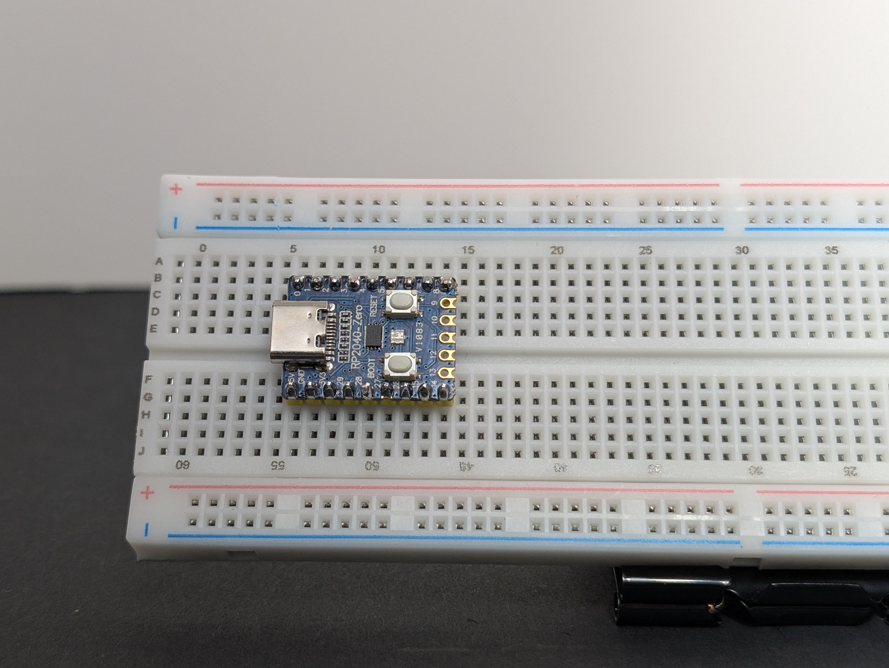
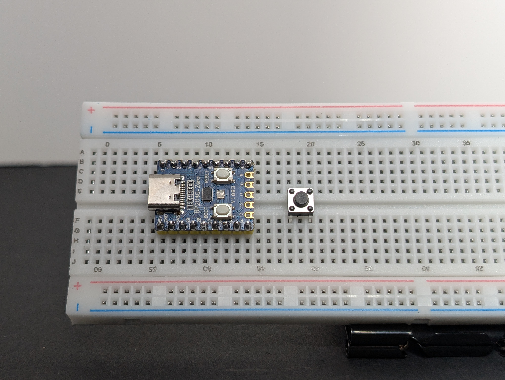
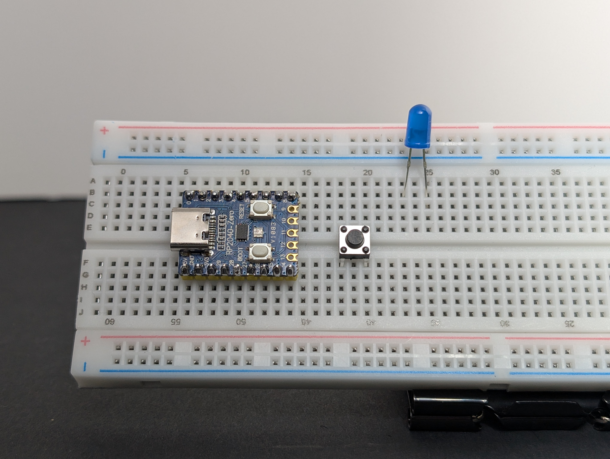
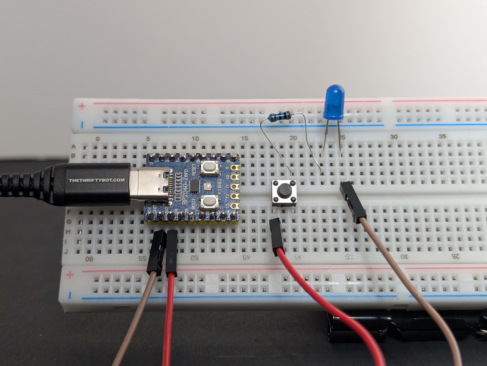
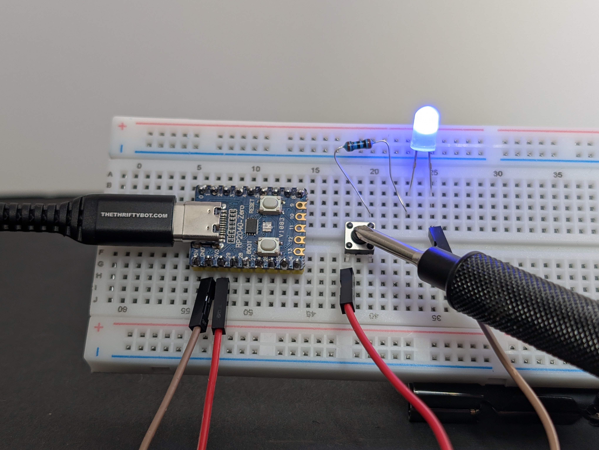
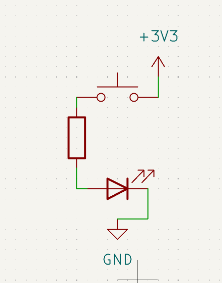

# 2: LED with Button

Now you will add a button so the LED only turns on when you press it.

This is the same basic LED circuit as circuit 1, but with a **switch** added. A pushbutton is a temporary switch: when you press it, it connects two points and completes the path.

Along the way you will practice:

- what a switch does (open path vs. closed path)
- how parts in **series** must all be connected for current to flow

Learn more (optional):

- [A circuit needs a complete path](../../index.md#a-circuit-needs-a-complete-path)
- [Series and parallel](../../index.md#series-and-parallel)

## Goal

Make the LED light only while the button is pressed.

## Parts you need

- 1 LED
- 1 resistor
- 1 pushbutton
- jumper wires
- breadboard
- RP2040-Zero

## Build idea

You are adding a switch into the path:

`3V3 -> button -> resistor -> LED -> GND`

When the button is not pressed, the path is open.

When the button is pressed, the path closes and the LED can light.

## Build steps

Try each step, then check your work with the blurred photos below. Did you connect it the way you meant to?

!!! warning "Important: choose the right resistor"
    Your kit has **150Ω** and **100Ω** resistors.
    
    - For a **red or yellow** LED, use **150Ω**
    - For a **green, blue, or white** LED, use **100Ω**
    
    Using the wrong resistor can damage an LED.

1. Place the RP2040-Zero into the breadboard.
   { .spoiler-img width="50%" }
2. Place the pushbutton so it bridges the center gap of the breadboard.
   { .spoiler-img width="50%" }
3. Place the LED so its legs are in different rows.
   { .spoiler-img width="50%" }
4. Put the resistor between one side of the button and the long leg (`+`) of the LED (in series).
   { .spoiler-img width="50%" }
5. Using a jumper wire, connect `3V3` to the same row as the button leg that shares a row with the resistor.
   { .spoiler-img width="50%" }
6. Using a jumper wire, connect the short leg (`-`) of the LED to `GND`.
   { .spoiler-img width="50%" }
7. Plug the board into USB, then test the button.
   { .spoiler-img width="50%" }
   { .spoiler-img width="50%" }

The LED should light only when the button is pressed.

{ width="30%" }

## What to notice

- The button is acting like a temporary bridge.
- If the button is turned the wrong way on the breadboard, the circuit may stay open all the time.
- This is still a circuit, just one you control with your finger.

## Try this next

What do the different pins on the pushbutton do, if you connect the resistor or power to it?
