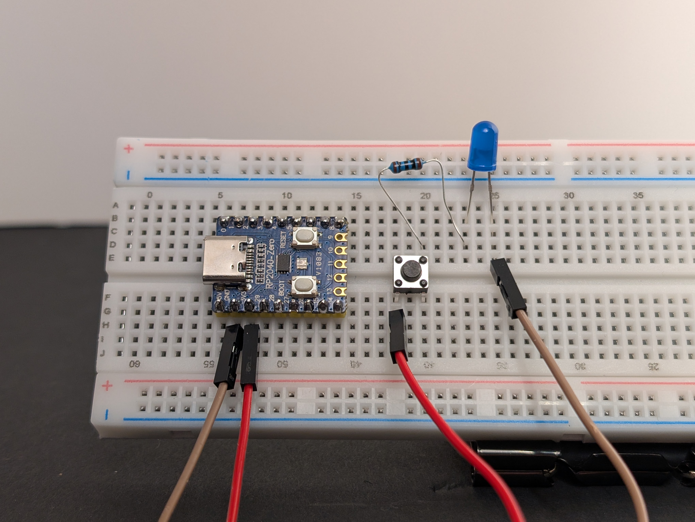
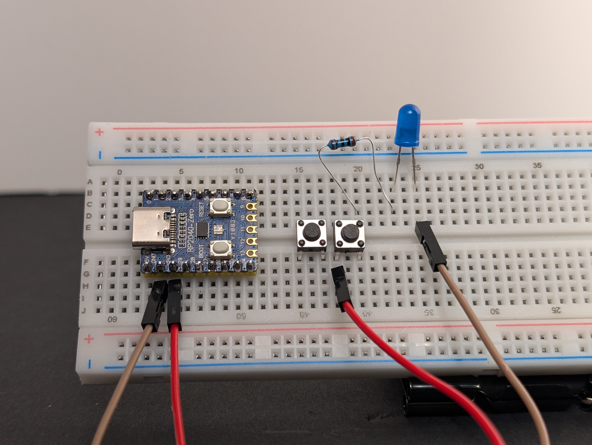
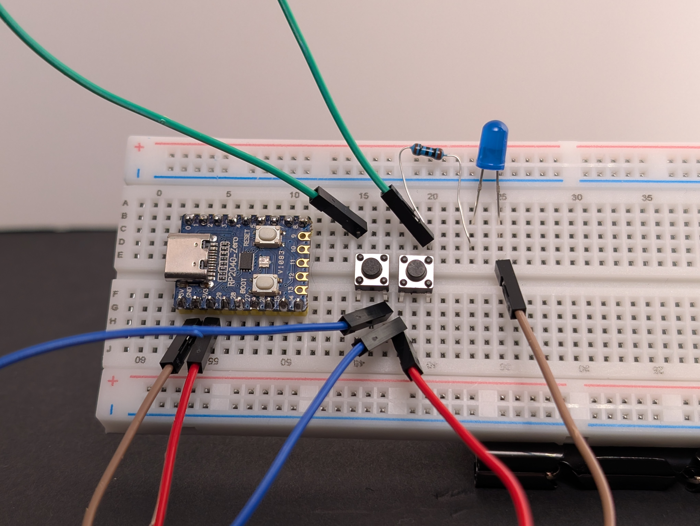
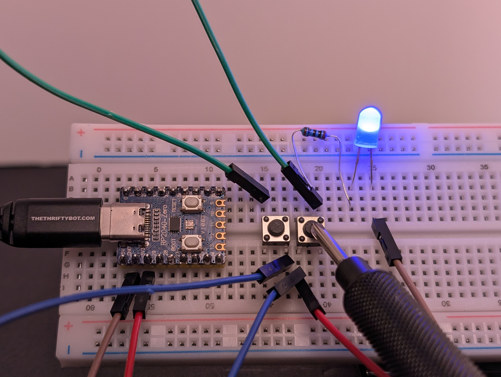
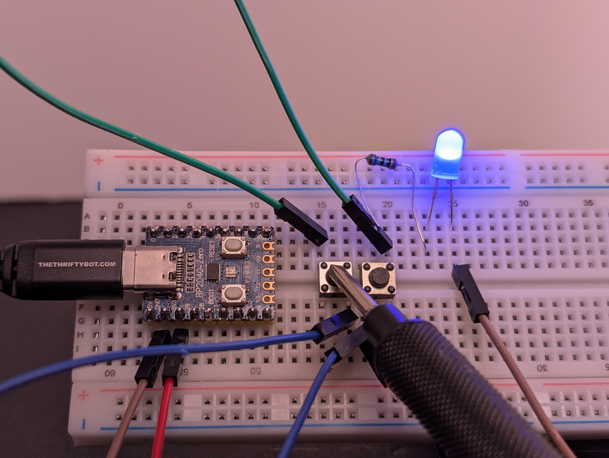
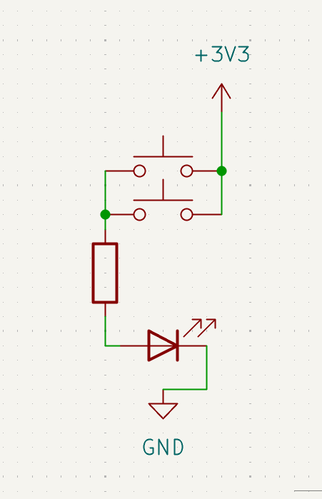

# 3: OR Gate with Two Buttons

This circuit is a simple **OR gate** made with two buttons.

If you want the fuller explanation first, see [OR gate in Electricity](../../index.md#or-gate).

An **OR gate** is a kind of logic gate. A logic gate is a circuit that turns an output on or off based on one or more inputs.

In this circuit, the two buttons are the inputs. The LED is the output. If **either** button can complete a path to power, the LED turns on.

Learn more (optional):

- [Simple logic with circuits](../../index.md#simple-logic-with-circuits)
- [OR gate](../../index.md#or-gate)
- [Series and parallel](../../index.md#series-and-parallel)

## Goal

Make the LED turn on if **either** button is pressed.

## Parts you need

- 1 LED
- 1 resistor
- 2 pushbuttons
- jumper wires
- breadboard
- RP2040-Zero

!!! warning "Important: choose the right resistor"
    Your kit has **150Ω** and **100Ω** resistors.
    
    - For a **red or yellow** LED, use **150Ω**
    - For a **green, blue, or white** LED, use **100Ω**
    
    Using the wrong resistor can damage an LED.

## Build idea

An **OR gate** turns the output on when **either** input can complete the path.

In this circuit, each button is its own input.

You will make two possible paths from `3V3` to the LED.

If button A is pressed, the LED gets power.

If button B is pressed, the LED also gets power.

If both are pressed, that still works too, which is exactly how an OR gate behaves.

## Build steps

Try each step, then check your work with the blurred photos below. Did you connect it the way you meant to?

1. Build circuit 2: [LED with Button](../2-led-with-button/index.md).
   { .spoiler-img width="50%" }
2. Unplug the USB, if it's still connected.
3. Add a second button, making sure it bridges the center of the breadboard.
   { .spoiler-img width="50%" }
4. Using a jumper wire, connect one side of both buttons to `3V3`.
   { .spoiler-img width="50%" }
5. Using a jumper wire, connect the other side of both buttons to the same row that leads into the resistor and LED.
   { .spoiler-img width="50%" }
6. Make sure the LED is still connected to `GND`.
7. Plug in the USB, then test each button one at a time, then both at once.
   { .spoiler-img width="30%" }
   { .spoiler-img width="30%" }

{ width="30%" }

## What to notice

- The two buttons are in **parallel**.
- Parallel means there is more than one path.
- Either path can make the LED light, so this circuit acts like an **OR gate**.

## Try this next

Can you add a third button?
