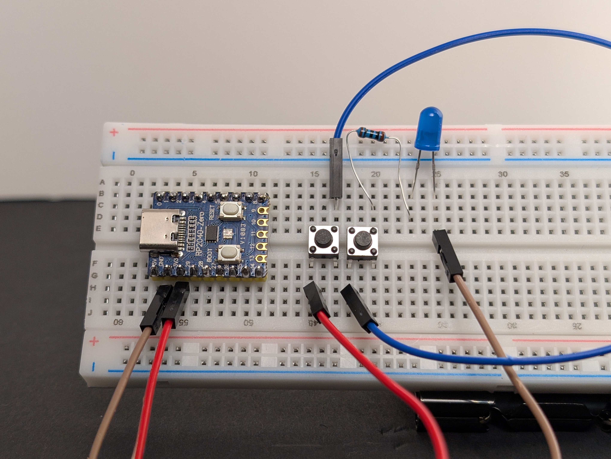
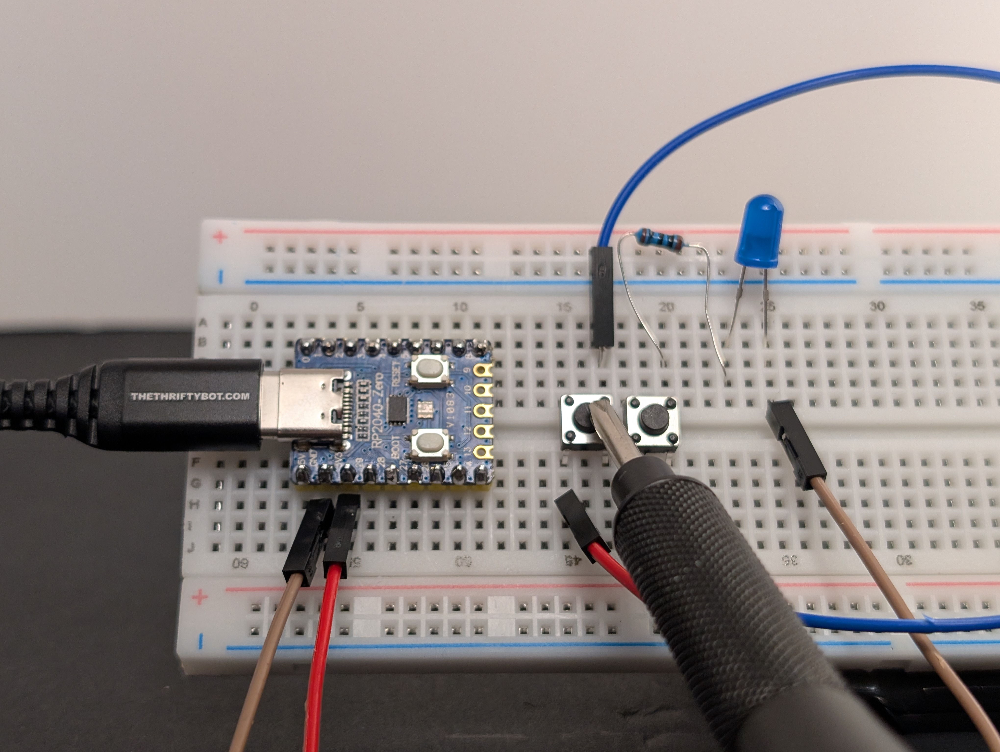
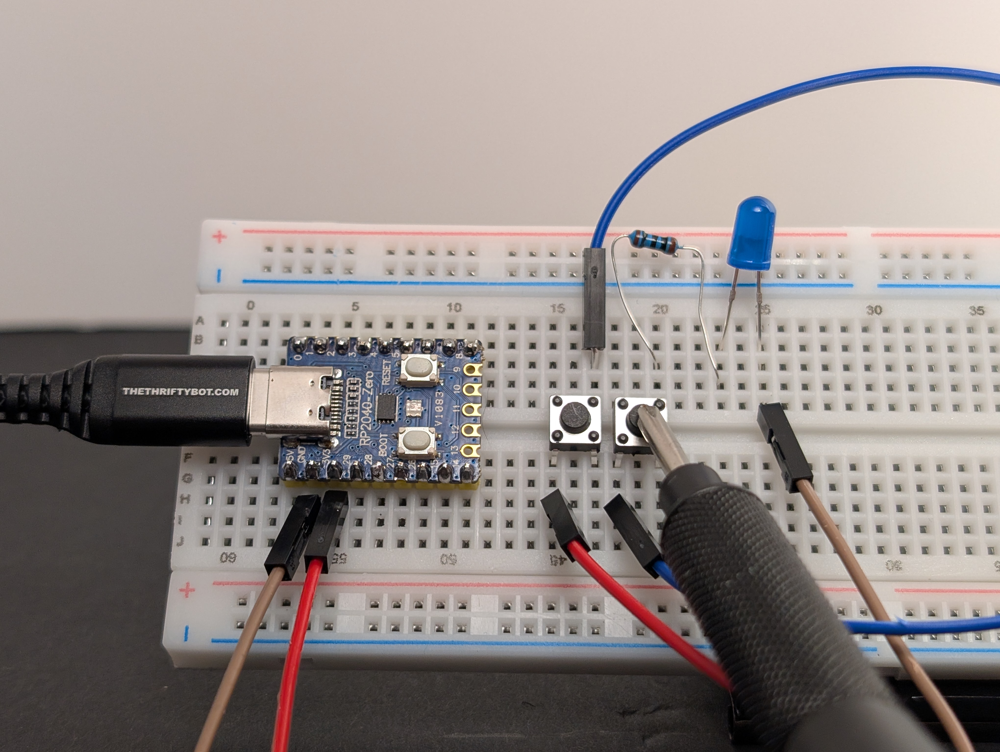
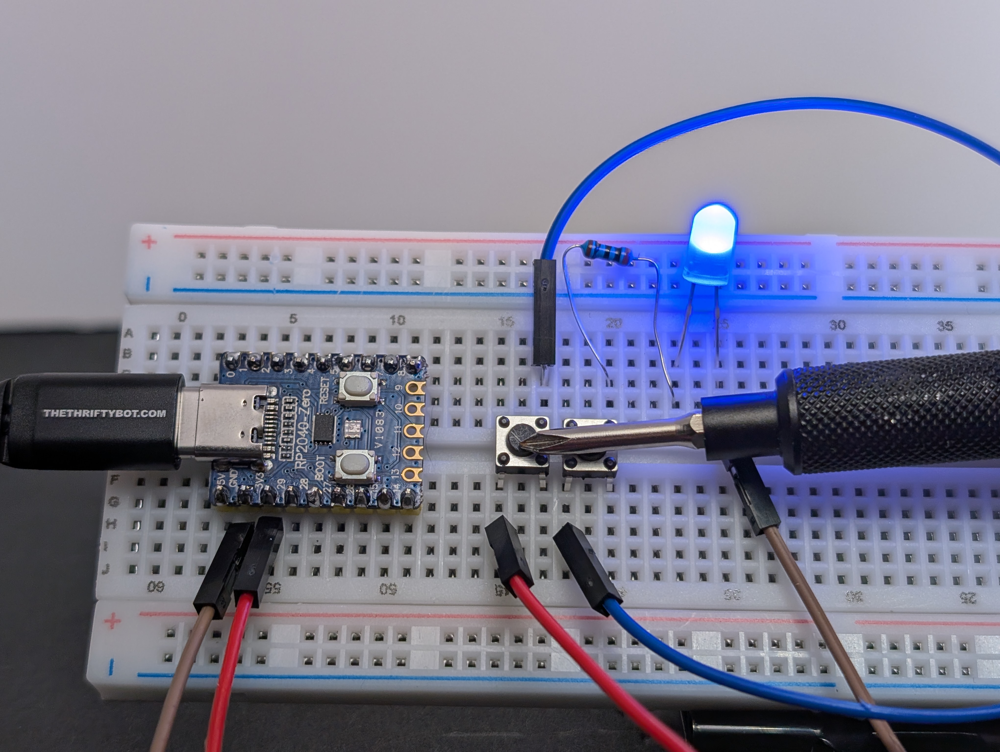
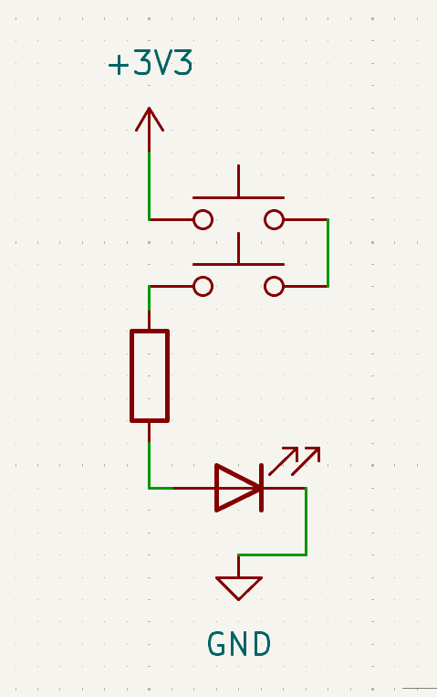

# 4: AND Gate with Two Buttons

This circuit is a simple **AND gate** made with two buttons.

If you want the fuller explanation first, see [AND gate in Electricity](../../index.md#and-gate).

An **AND gate** is a kind of logic gate. A logic gate is a circuit that turns an output on or off based on one or more inputs.

In this circuit, the two buttons are the inputs. The LED is the output. The LED turns on only when **both** buttons are pressed, because they are placed in the same path.

Learn more (optional):

- [Simple logic with circuits](../../index.md#simple-logic-with-circuits)
- [AND gate](../../index.md#and-gate)
- [Series and parallel](../../index.md#series-and-parallel)

## Goal

Make the LED turn on only when **both** buttons are pressed.

## Parts you need

- 1 LED
- 1 resistor
- 2 pushbuttons
- jumper wires
- breadboard
- RP2040-Zero

!!! warning "Important: choose the right resistor"
    Your kit has **150Ω** and **100Ω** resistors.
    
    - For a **red or yellow** LED, use **150Ω**
    - For a **green, blue, or white** LED, use **100Ω**
    
    Using the wrong resistor can damage an LED.

## Build idea

An **AND gate** only turns the output on when **both** inputs complete the path at the same time.

This time the buttons go one after another in the same path:

`3V3 -> button A -> button B -> resistor -> LED -> GND`

If either button is not pressed, the path is still broken, which is exactly how an AND gate behaves.

## Build steps

Try each step, then check your work with the blurred photos below. Did you connect it the way you meant to?

1. Build circuit 2: [LED with Button](../2-led-with-button/index.md).
   { .spoiler-img width="50%" }
2. Unplug the USB, if it's still connected.
3. Add a second button, making sure it bridges the center of the breadboard.
   { .spoiler-img width="50%" }

4. Disconnect `3V3` wire from the second button, and connect it to the first button.
   { .spoiler-img width="50%" }

5. Using a jumper wire, connect the first button to the second button.
   { .spoiler-img width="50%" }

6. Make sure the LED is still connected to `GND`.
7. Plug in the USB, then test each button one at a time, then both at once.
   { .spoiler-img width="30%" }
   { .spoiler-img width="30%" }
   { .spoiler-img width="30%" }

The LED should turn on only when both buttons are pressed at the same time.

{ width="30%" }

## What to notice

- The buttons are in **series**.
- Series means one path with parts placed one after another.
- Every part in that one path has to be connected for current to flow, so this circuit acts like an **AND gate**.

## Try this next

- Can you add a third button?
- Can you mix this AND logic with the OR logic from the last circuit?
