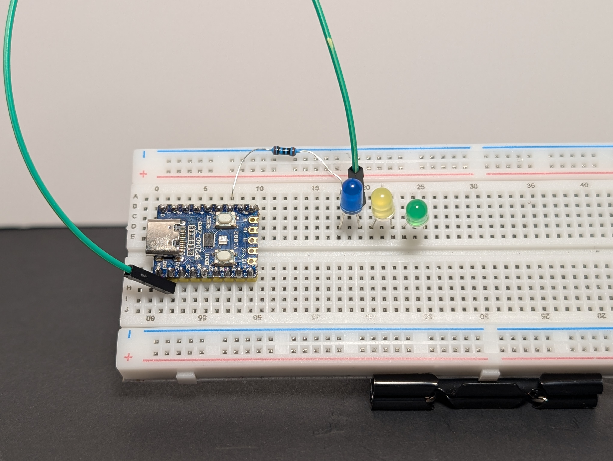

# 7: LED Chase

This project makes three LEDs turn on one after another, like a moving light.

This is a simple animation made from very simple outputs. You will control multiple LEDs by turning them on and off in order with a loop.

Coding ideas you will use:

- a **list** of GPIO pin objects so you can treat “three LEDs” as one thing
- a **loop inside a loop** (`while True` + `for led in leds`) to repeat the pattern forever
- a **timing variable** (`delay`) to control the speed

Learn more (optional):

- [List or array](../programming-basics.md#list-or-array)
- [Loops (infinite loop)](../programming-basics.md#infinite-loop)

## Goal

Create a chase animation across three LEDs.

## Parts you need

- 3 LEDs
- 3 resistors
- jumper wires
- breadboard
- RP2040-Zero

!!! warning "Important: choose the right resistor"
    Your kit has **150Ω** and **100Ω** resistors.
    
    - For a **red or yellow** LED, use **150Ω**
    - For a **green, blue, or white** LED, use **100Ω**
    
    Using the wrong resistor can damage an LED.

## Wiring idea

Build it first, then compare your setup to the picture. Did you connect each part to the pin you meant to use?

Connect each LED to its own GPIO pin. Each LED should have its own resistor and its own path back to `GND`.

Example pins: `GP6 (GPIO 6)`, `GP7 (GPIO 7)`, and `GP8 (GPIO 8)`.

1. Build the circuit from `5: Blink with Code` and `6: PWM Fade` as a starting point, using `GP6 (GPIO 6)` for the first LED.
   { .spoiler-img width="50%" }
2. Add two more LEDs to the breadboard.
   { .spoiler-img width="50%" }
3. Connect the long leg (`+`) of the second LED to `GP7 (GPIO 7)`, and the short leg (`-`) to `GND`.
   { .spoiler-img width="50%" }
4. Connect the long leg (`+`) of the final LED to `GP8 (GPIO 8)`, and the short leg (`-`) to `GND`.
   { .spoiler-img width="50%" }

## Code


<div class="code-tabs">
  <div class="code-tabs-nav">
    <button class="code-tab" data-tab="int-mp">MicroPython</button>
    <button class="code-tab" data-tab="int-arduino">Arduino</button>
  </div>
  <div class="code-panel" data-tab="int-mp">

<div class="admonition note">
  <p class="admonition-title">Pin reminder</p>
  <p>Wired your LEDs to different GPIO pins? Update <code>LED_GPIOS</code> in the code below to match your wiring.</p>
</div>

```python
import machine
import time

# Choose the GPIO pins your LEDs are connected to.
LED_GPIOS = [6, 7, 8]

leds = [machine.Pin(gpio, machine.Pin.OUT) for gpio in LED_GPIOS]

# --- ADJUST THIS FOR SPEED ---
delay = 0.5  # Half a second per jump
# -----------------------------

print("Jumpy block chase starting...")

while True:
    for led in leds:
        # 1. Turn the current LED ON
        led.value(1)
        
        # 2. Wait so we can see it
        time.sleep(delay)
        
        # 3. Turn the current LED OFF before moving to the next
        led.value(0)
```

  </div>
  <div class="code-panel" data-tab="int-arduino">

```cpp
Arduino Code Coming Soon
```

  </div>
</div>

## What to notice

- Only one LED is on at a time
- The timing between each step makes the motion feel faster or slower
- This is a simple animation made from very basic output control

## Try this

- Reverse the direction
- Speed it up
- Pause longer on the last LED before the pattern starts again
