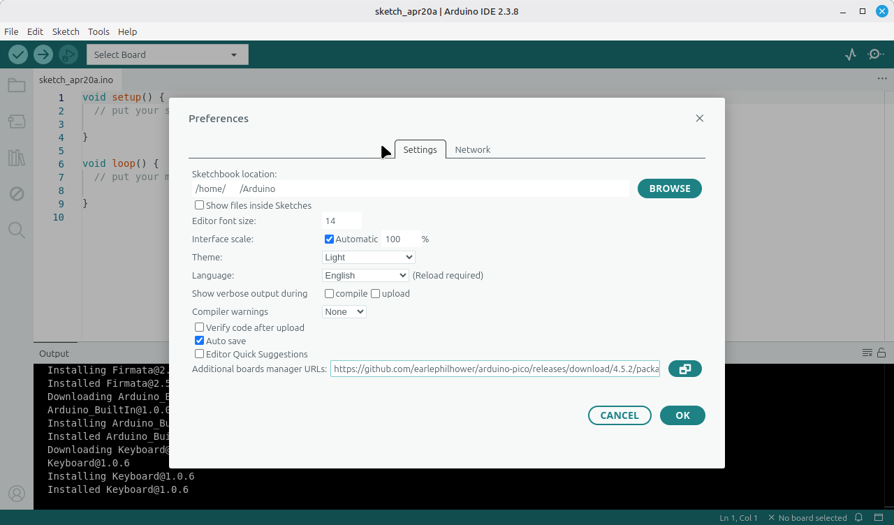
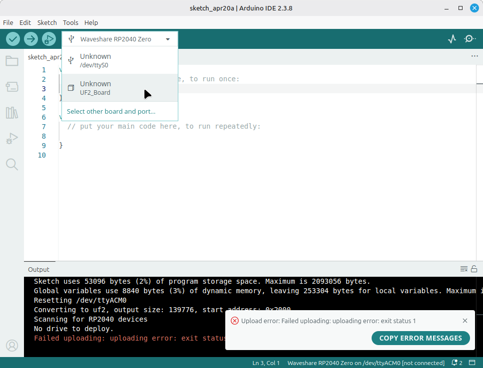
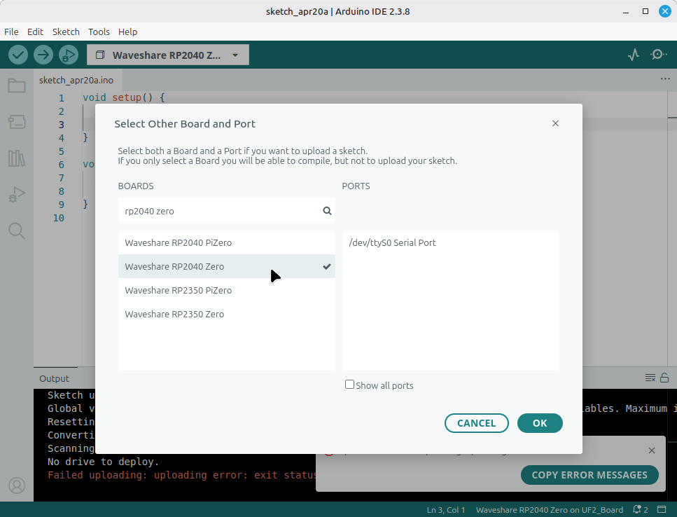
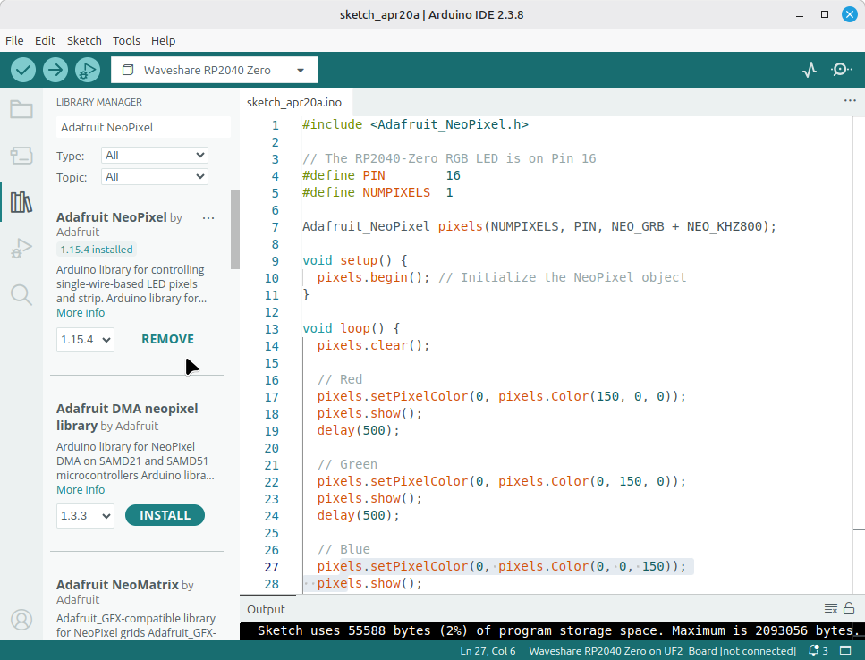

# Set Up Arduino IDE

If you already know Arduino or C++, this route will probably feel more natural.

For the main FreedomSTEM lessons, we still recommend **Thonny + MicroPython**, but Arduino IDE is a perfectly good extra option.

## What you need

- your RP2040-Zero
- a USB cable that fits it
- a computer
- Arduino IDE installed

## Step 1: Install Arduino IDE

Go to the [Arduino website](https://www.arduino.cc/en/software/) and install the version for your computer.

## Step 2: Add RP2040 board support

The simplest route for many RP2040 boards is the **arduino-pico** core.

Board manager URL:

```
https://github.com/earlephilhower/arduino-pico/releases/download/4.5.2/package_rp2040_index.json
```

To add it:

1. Open Arduino IDE
2. Go to `File > Preferences`
3. Find **Additional Boards Manager URLs**
4. Paste the URL above
    {width="75%"}

## Step 3: Connect your board

Hold down the `BOOT` button while you plug the RP2040-Zero into your computer. It should show up as a USB drive. If it doesn't work, press and hold `BOOT`, click `RESET`, and release `BOOT`.

In the main page, click `Select Board`. Click the option for an Unknown UF2_Board.

{width="75%"}

Then, search for `rp2040 zero` and select the `Waveshare RP2040 Zero` option. Click `OK`

{width="75%"}

## Step 5: Test with Blink

For a first test, we'll use the built-in LED

1. Open the library manager on the left bar.
2. Search for and install `Adafruit NeoPixel`.
    {width="75%"}
3. Next, copy the below code and click `Upload`.

> If the upload fails, your board probably isn't in upload mode. Hold down the `BOOT` button while you plug the RP2040-Zero into your computer. It should show up as a USB drive. If it doesn't work, press and hold `BOOT`, click `RESET`, and release `BOOT`.


<div class="code-tabs">
  <div class="code-tabs-nav">
    <button class="code-tab" data-tab="int-arduino">Arduino</button>
  </div>
  <div class="code-panel" data-tab="int-arduino">

```cpp
#include <Adafruit_NeoPixel.h>

// The RP2040-Zero RGB LED is on Pin 16
#define PIN        16 
#define NUMPIXELS  1

Adafruit_NeoPixel pixels(NUMPIXELS, PIN, NEO_GRB + NEO_KHZ800);

void setup() {
  pixels.begin(); // Initialize the NeoPixel object
}

void loop() {
  pixels.clear();

  // Red
  pixels.setPixelColor(0, pixels.Color(150, 0, 0));
  pixels.show();
  delay(500);

  // Green
  pixels.setPixelColor(0, pixels.Color(0, 150, 0));
  pixels.show();
  delay(500);

  // Blue
  pixels.setPixelColor(0, pixels.Color(0, 0, 150));
  pixels.show();
  delay(500);
}
```

  </div>
</div>

{width="75%"}

## If upload does not work

Try these checks:

- Make sure the USB cable supports data
- Double-check the selected port
- Double-check the selected board
- Unplug and reconnect the board
- Try the board's boot button method if needed for first-time flashing

## Important note for this curriculum

The main project pages in this kit use **MicroPython** examples, not Arduino sketches. If you choose Arduino IDE, you will need to translate some of those ideas into Arduino-style C++.
