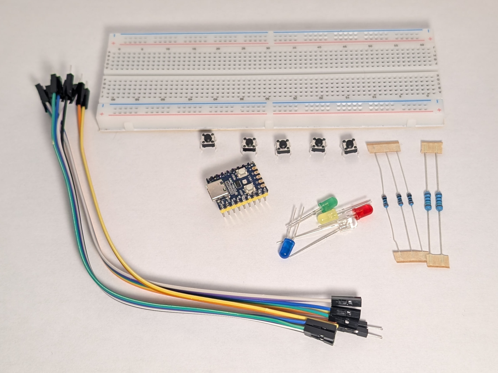

# Circuits Kit (Recommended for Ages 11+)

Learn how simple circuits work and how code can control them. The early projects stay small on purpose, so you can get used to the parts, the breadboard, and the feeling of testing things as you build.

## What's in the box

- 1 RP2040-Zero board
- 1 breadboard
- jumper wires
- LEDs
    - 1 red
    - 1 yellow
    - 1 green
    - 1 blue
    - 1 white
- resistors
    - 2 x 150 ohm
    - 3 x 100 ohm
- 5 pushbuttons

{ width=50% }

## What else you may need

- A USB cable that fits the RP2040-Zero
- A computer for programming
- A little patience while you test and fix mistakes

## Pick a coding path

If you are deciding how you want to code, start here:

1. [Choose Your Coding Path](coding-paths.md)
2. [Set Up Thonny](setup-ide.md)
3. [Set Up Arduino IDE](arduino-setup.md)

For the main FreedomSTEM lessons, **Thonny + MicroPython** is the best fit.

## How to use these pages

If this is your first time with the kit, this order works well:

1. [Electricity](../index.md)
2. [Coding](programming-basics.md)
3. [Choose Your Coding Path](coding-paths.md)
4. [Set Up Thonny](setup-ide.md) or [Set Up Arduino IDE](arduino-setup.md)
5. [Meet Your Kit](parts-guide.md)
6. [Safety and Help](safety.md)
7. [Circuit #1: Simple LED](1-simple-led/index.md)

If you already know your way around a breadboard and can set up your IDE, you can jump straight to the numbered circuit pages.

## Circuit path

1. [1: Simple LED](1-simple-led/index.md)
2. [2: LED with Button](2-led-with-button/index.md)
3. [3: Two Buttons OR](3-two-buttons-or/index.md)
4. [4: Two Buttons AND](4-two-buttons-and/index.md)
5. [5: Blink with Code](5-blink-code/index.md)
6. [6: PWM Fade](6-pwm-fade/index.md)
7. [7: LED Chase](7-led-chase/index.md)
8. [8: Smooth Chase with PWM](8-smooth-chase/index.md)
9. [9: Traffic Light](9-traffic-light/index.md)
<!-- 10. [10: Color Picker](10-color-picker/index.md)
11. [11: Reaction Timer](11-reaction-timer/index.md) -->
10. [10: What Next?](12-what-next/index.md)

## What you will learn

By the time you work through these activities, you will have practiced:

- building a circuit on a breadboard
- using a resistor to protect an LED
- reading a button press
- writing simple Python code
- using inputs and outputs together
- testing and fixing problems when a circuit does not work the first time
