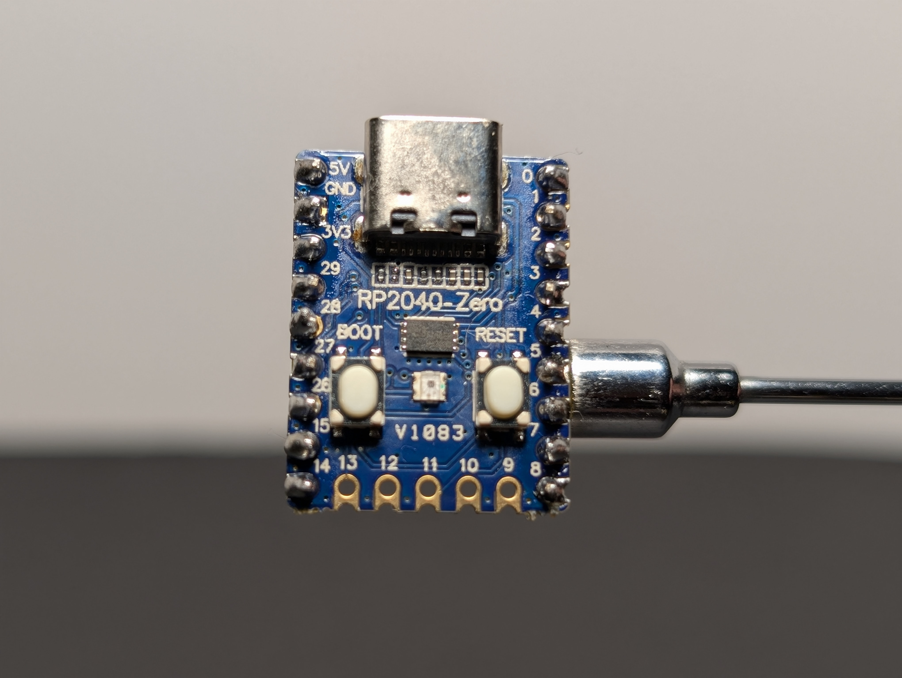
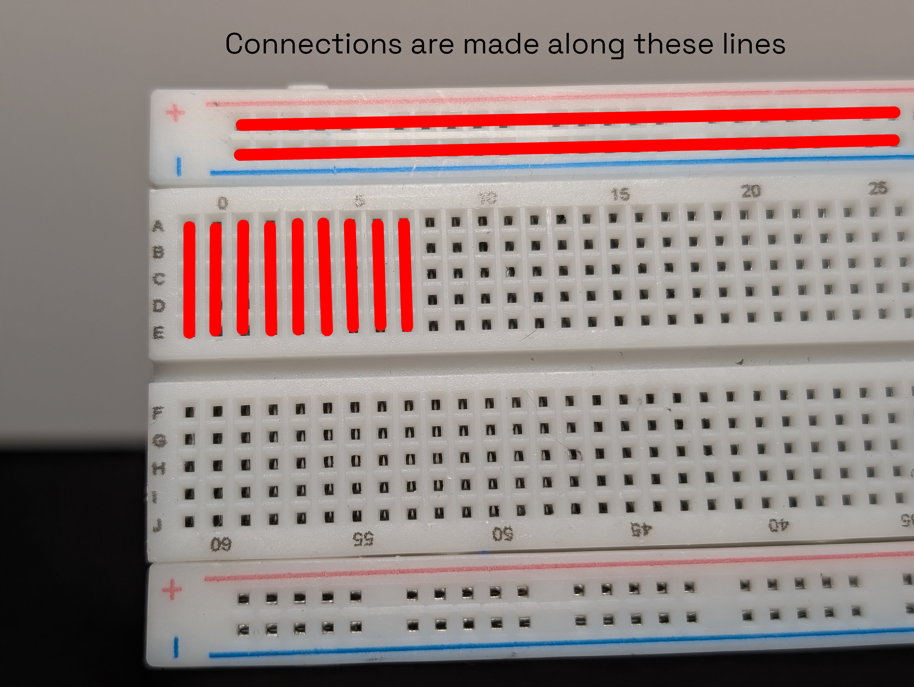
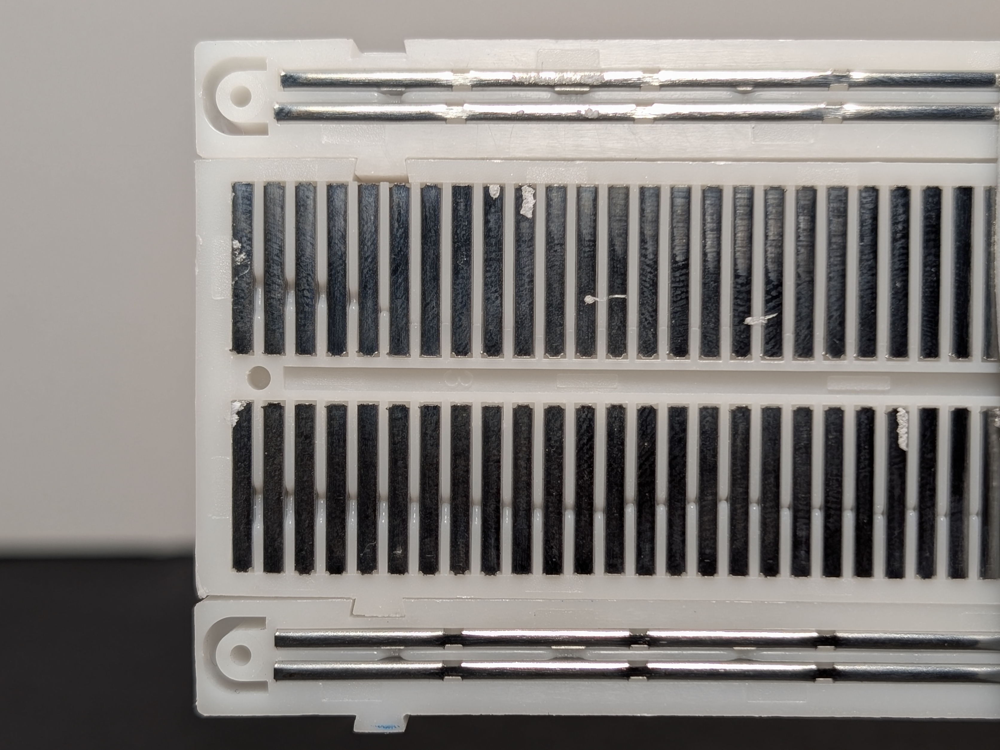
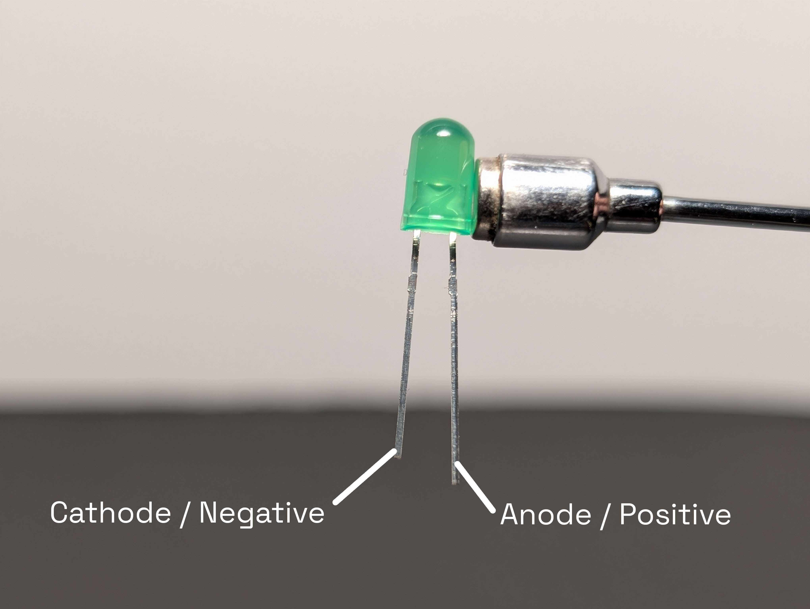
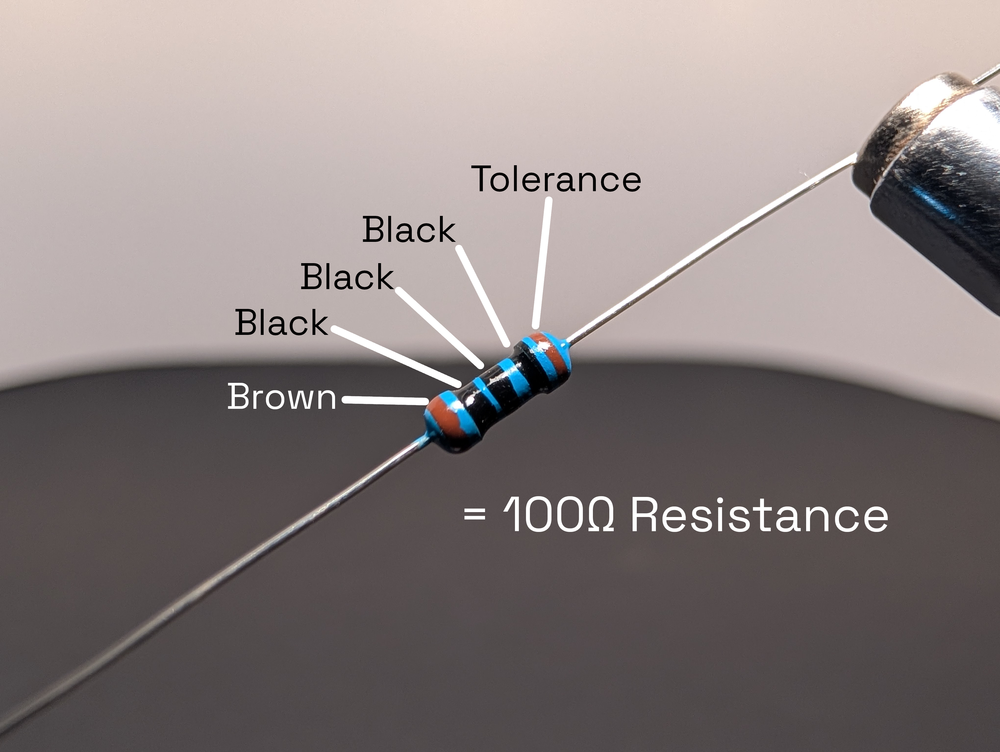
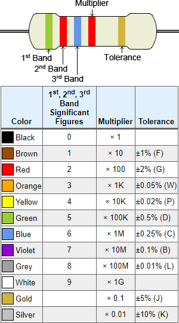
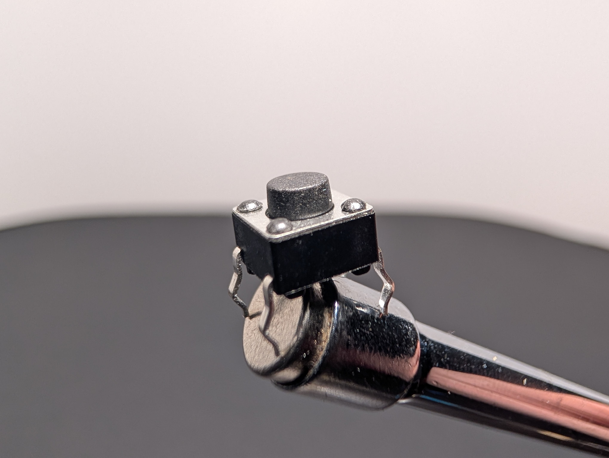
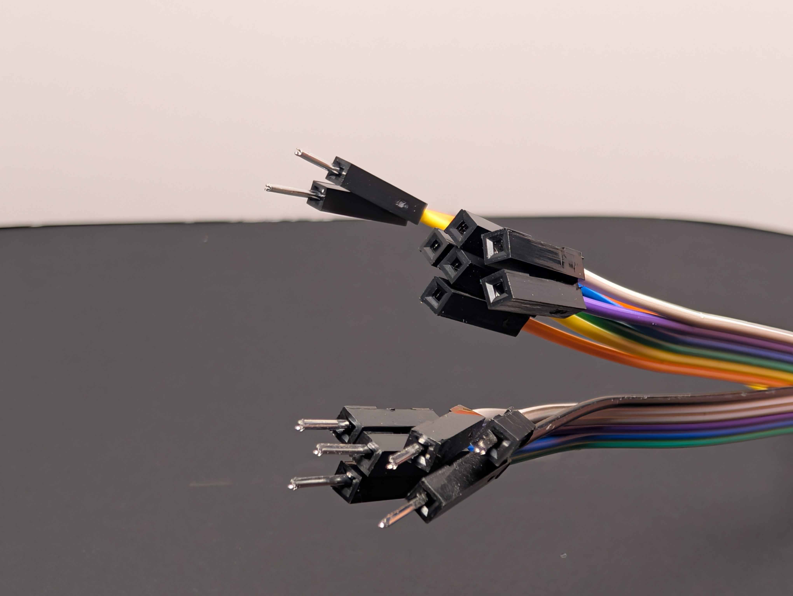

# Meet Your Kit

Before building much, it helps to know what the parts are and what job each one does.

## RP2040-Zero

The RP2040-Zero is the small computer in your kit. It can:

- turn pins on and off
- read buttons
- run code you write
- control LEDs and other parts

It is the brain of the project.

{width="50%"}

## Breadboard

A breadboard lets you build circuits without soldering. You push parts and wires into the holes, and metal strips underneath connect some of those holes together.

It is basically a reusable place to build and test circuits.

Most breadboards have:

- long side rails for power
- short rows in the middle for connecting parts
- a center gap that helps you place chips and keep the two sides separate

The holes may look separate from the top, but many of them are electrically connected underneath.

{width="50%"}

{width="50%"}

## LEDs

LED stands for **Light Emitting Diode**.

An LED lights up when current flows through it in the correct direction.

Important things to know:

- An LED has a **long leg** and a **short leg**
- The **long leg** is the **anode** (the `+` side)
- The **short leg** is the **cathode** (the `-` side)
- If the legs are hard to tell, the **flat side** of the LED marks the **cathode** (the short leg / `-` side)
- If you put it in backward, it will not light up
- If you connect it without the right resistor, too much current can damage it

{width="50%"}

## Resistors

A resistor limits current.

In this kit, resistors are important because they help protect LEDs from getting too much current.

A resistor does not "use up" electricity. Instead, it limits how much current can flow in that part of the circuit.

The color bands tell you the resistor value.

{width="50%"}

[Resistor calculator at calculator.net](https://www.calculator.net/resistor-calculator.html)

## Pushbuttons

A pushbutton is a switch you can press with your finger.

Depending on how you wire it, a button can:

- connect two parts of a circuit when pressed
- send a signal to the RP2040-Zero
- let your code react to input

Buttons are useful in games and challenges because they let people control what happens.

{width="50%"}

## Jumper wires

Jumper wires are the small wires that connect one part of the circuit to another.

They are helpful because they make it easy to:

- connect the board to the breadboard
- move signals from one place to another
- test different layouts quickly

{width="50%"}

## Putting the parts together

One simple way to think about the kit is:

- the RP2040-Zero is the brain
- the breadboard is the workspace
- jumper wires are the paths
- buttons are inputs
- LEDs are outputs
- resistors help keep the circuit safe and working properly
