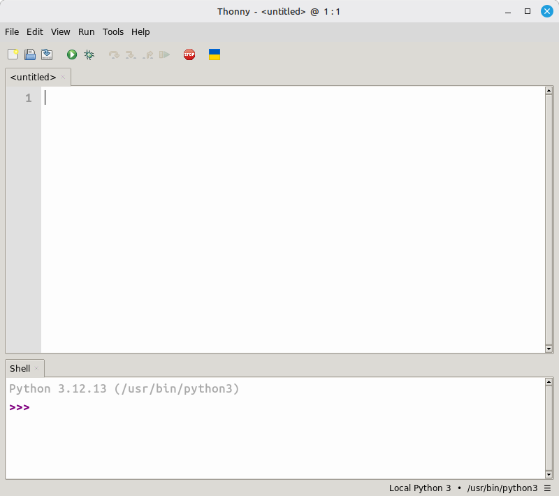
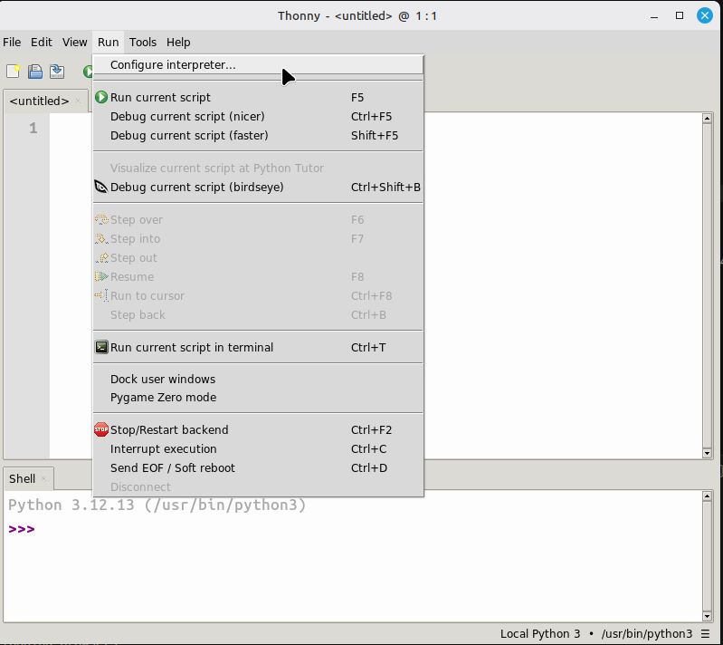
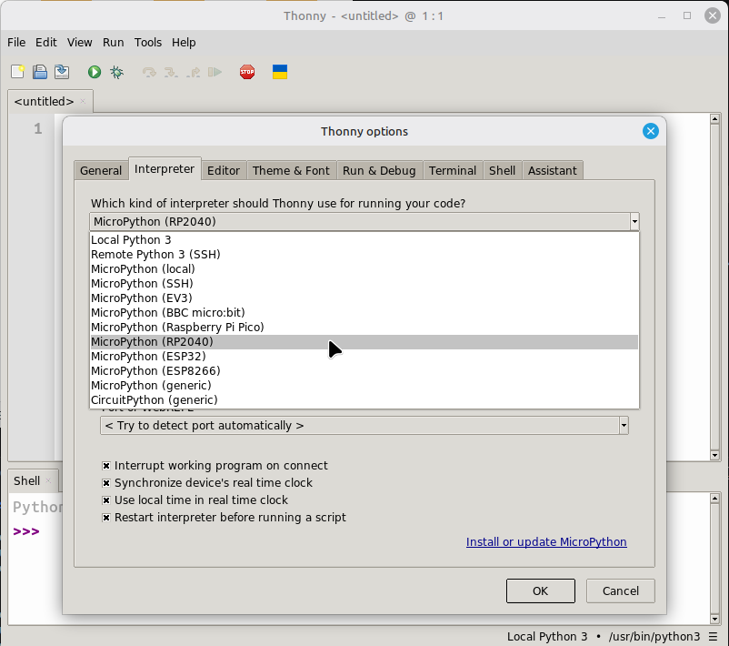
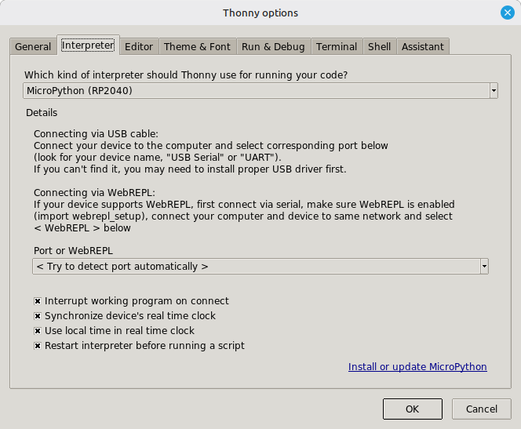
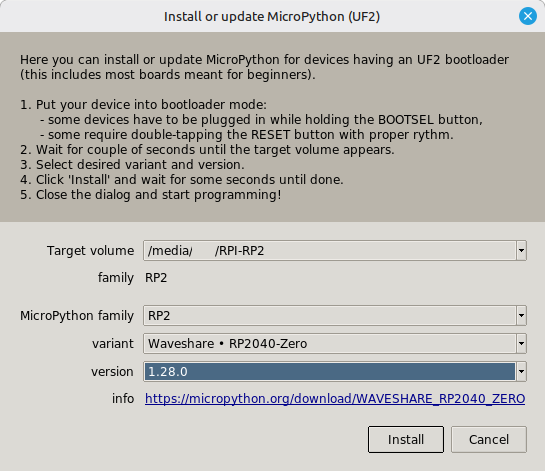
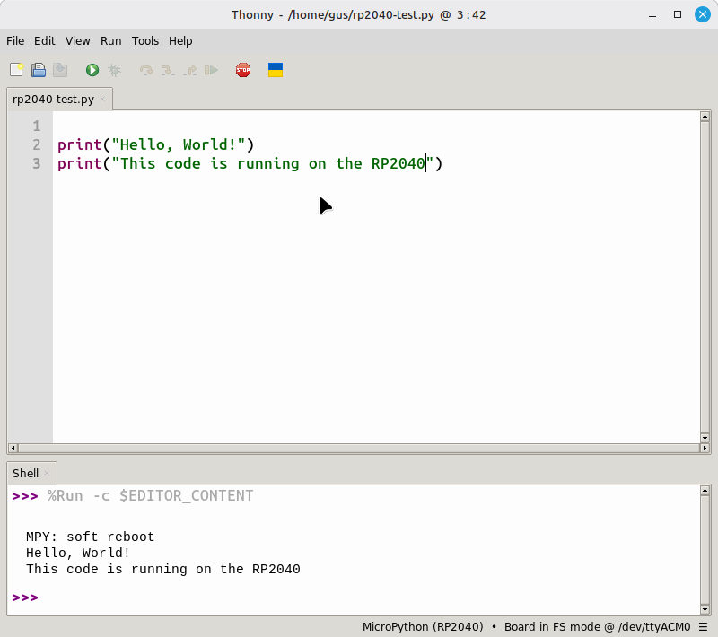
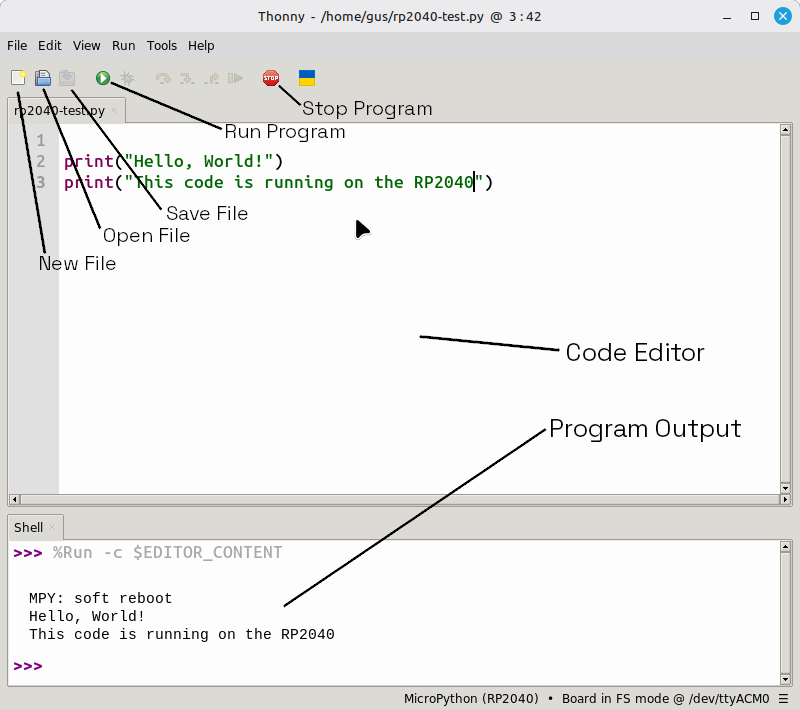

# Set Up Thonny

For this kit, **Thonny** is the easiest place to start. It is simple, reliable, and works well with MicroPython on the RP2040-Zero.

If you have used Arduino or C++ before, you may also want the [Arduino IDE setup page](arduino-setup.md).

Once Thonny is working, the next helpful stop is [Coding](programming-basics.md).

## What is an IDE?

IDE stands for **Integrated Development Environment**. In plain language, it is the app where you:

- write code
- run code
- fix mistakes
- send code to your board

## What you need

- your RP2040-Zero
- a USB cable that fits it
- a computer
- internet access to download Thonny

## Step 1: Install Thonny

Go to the [Thonny website](https://thonny.org/) and install the version for your computer. For more help, use the [Thonny GitHub Wiki](https://github.com/thonny/thonny/wiki)

- Windows: install the Windows version
- Mac: install the macOS version
- Linux: use the version that matches your system

## Step 2: Plug in your board

Connect the RP2040-Zero to your computer with the USB cable.

The first time you plug it in, your computer may take a moment to recognize it.

## Step 3: Open Thonny

When Thonny opens, you should see:

- a place to type code
- a run button
- a shell area for messages

{width="75%"}

## Step 4: Choose MicroPython for the board

In Thonny, go to `Run > Configure interpreter...` and choose **MicroPython (RP2040)**.

That tells Thonny which kind of board it should talk to.

{width=25%}
{width=25%}

## Step 5: Install MicroPython on your RP2040

> Note: if you have programmed your RP2040 with Thonny before, you probably already did this step and can skip to step 6

Brand new RP2040 boards need to be set up once to work with MicroPython. To do this, click `Install or update MicroPython` on the `Configure interpreter` window.

{width="75%"}

Once you click install, a new window will pop up. Select the following options:

- MicroPython family: `RP2`
- variant: `Waveshare - RP2040-Zero`
- version: [leave the default value]

Then, click install. The process might take a few minutes.

{width="75%"}

## Step 5: Test with a tiny program

Paste this code into Thonny:

<div class="code-tabs">
  <div class="code-tabs-nav">
    <button class="code-tab" data-tab="int-mp">MicroPython</button>
  </div>
  <div class="code-panel" data-tab="int-arduino

```cpp
print("Hello, World!")
print("This code is running on the RP2040")
```

  </div>
</div>


Click `Run`. If everything is connected correctly, you should see the message appear in the shell.

{width="75%"}

## Step 6: Save code to the board

When you save, Thonny may ask whether to save the file:

- on the computer
- on the RP2040 board

If you want the board to run the file by itself later, saving to the board is the better choice.

## If the board is not showing up

Try these checks:

- Make sure the USB cable can carry data, not just power
- Unplug the board and plug it back in
- Close and reopen Thonny
- Try a different USB port
- Try a different cable if you have one

## Good habit

Give your files clear names, like `blink.py` or `reaction_timer.py`. That makes it much easier to find your work later.

{width="75%"}
